# 2026无人系统具身智能算法挑战赛--四足机器狗特种场景使用手册

## 介绍

​	本手册专为" 2026无人系统具身智能算法挑战赛 "中的四足机器狗特种场景应用挑战赛参赛队伍设计，提供完整的大模型-四足机器狗协同开发指导手册。手册围绕"视觉感知-决策控制-机械狗执行"的技术闭环，帮助参赛者快速构建基于九格大模型的四足机器狗控制系统。

​	本手册采用"理论→工具→实践"的递进式设计，助力参赛团队快速实现"语言指令→场景理解→动作执行"的智能四足机器狗控制闭环，为大赛竞技提供坚实的技术支撑。

```
## 2026无人系统具身智能算法挑战赛 使用手册限制条款

© 2026无人系统具身智能算法挑战赛组委会 版权所有

### **使用授权范围：**  

本手册仅授权以下主体在赛事期间使用：

1. 经组委会认证的参赛团队队员
2. 赛事官方裁判及技术监督人员
3. 组委会授权的培训导师

### **严格禁止事项：**  

-  任何形式的商业性使用或二次销售  
-  向非参赛组织或个人进行传播  
-  改编后用于其他赛事或商业项目  
-  在线平台/文库的公开传播  

### **使用约束：**  

手册所含技术方案、赛事规则及数据参数等知识产权归组委会所有，参赛者仅限：

-  赛事筹备期用于技术方案设计参考
-  正式竞赛期间作为操作规范依据
-  赛后总结阶段用于技术复盘分析

### **免责声明：**  

 本手册内容按"现有状态"提供：
 组委会不承担因手册信息导致的技术方案偏差责任  
 不保证所含方案满足特定技术场景的实施需求  
 对使用后果不承担直接或间接法律责任  

*违反本条款者组委会有权取消参赛资格并追究法律责任*
```


## 仿真部分

## **（一）进入镜像**

点击链接https://www.gpufree.cn/images，进入算力自由镜像仓库，搜索**TCEI 2026 四足机器狗特种场景应用挑战赛**，选择该镜像，点击快速创建。

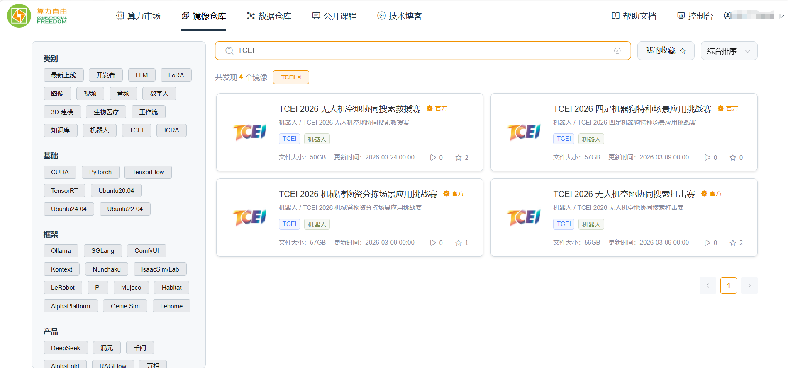

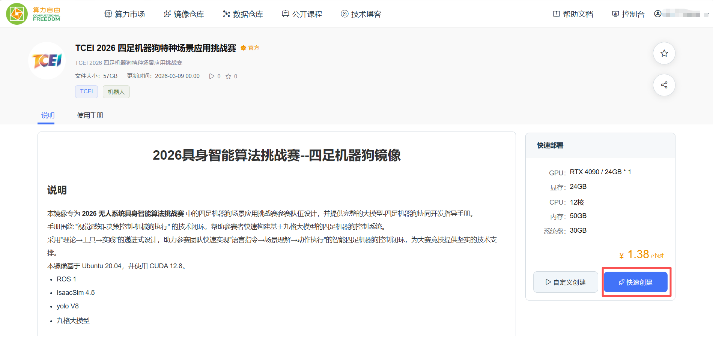

初次使用算力自由平台，可以参看平台[快速开始](https://www.gpufree.cn/docs/guide/quick_start.html)https://www.gpufree.cn/docs/guide/quick_start.html文档。

专用镜像体积较大，可能需要较长的拉取时间，需要几分钟或者十几分钟的等待。开机过程是不会收取算力费用的。创建成功之后进入控制台，从控制台进入远程桌面。

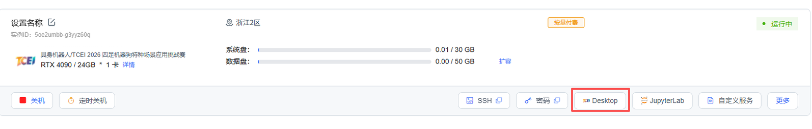点击进入远程桌面。

## （二）ROS 1环境

进入远程桌面之后，先检查环境，ROS 1环境是已经预装的，在快速启动中包括了他的启动方式：

直接开启三个终端：

**终端一：**

```bash
roscore     
```

**终端二：**

```bash
rosrun turtlesim turtlesim_node
```

**终端三：**

```bash
rosrun turtlesim turtle_teleop_key
```

结果输出：

使用键盘上下左右操作，可以看到界面上的小乌龟在按照键盘指令移动。测试完成后可以关闭终端一二三。


## （三）检查文件

比赛的环境包括了：

- 源代码
- ROS 1
- IsaacSim 4.5
- yolo V8
- 九格大模型

注：在该镜像桌面中，环境与相关的代码已经为选手提前配置好，无需再次配置，若想自己从零开始动手配置，参考该技术文档https://blog.gpufree.cn/blogs/quadrupedal_robot_build.html。

在该桌面中，只需要将各文件放在正确的目录下。在文件管理器中，将已经下载的`Go2`、`EAICON`、`inference`文件夹放在已经创建的`/root/`文件夹下。形成这样的文件目录：

```
/root/
```

├── `Go2/`

├── `EAICON/`

├── `inference/`

​    └── `Embodied/`

​    └── `FM9G4B-V/`

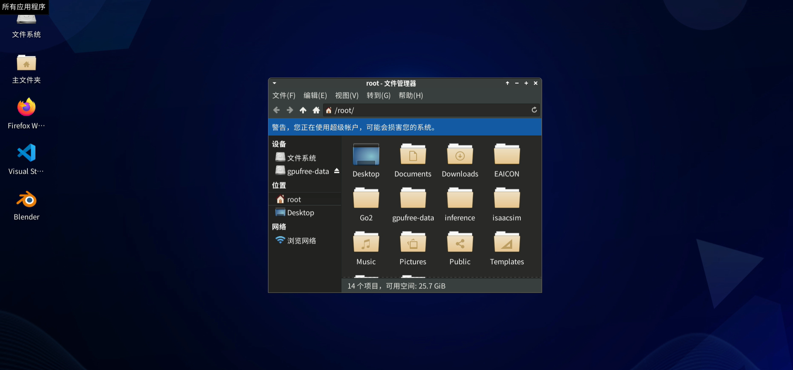

检查好各文件的位置，防止后续仿真时找不到文件而出错。

## （四）IsaacSim 4.5环境

检查 Isaac Sim 是否能成功启动，Isaac Sim 安装在`/root/isaacsim`，打开终端一：

```bash
cd /root/isaacsim
#启动
./isaac-sim.sh
```

首次启动，需要访问 Nvidia 官方下载部分相关文件，可能会较慢。在使用之前，建议关闭 Isaac Sim 默认的 Eco Mode，并打开 DLSS 以提高性能。

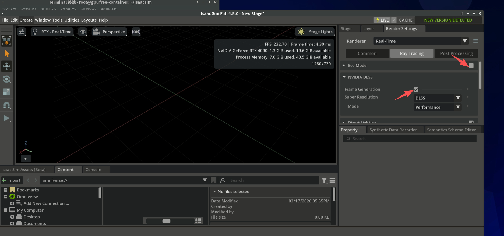

测试完成后关闭终端一。

## （五）测试模型

测试是否能运行九格大模型，打开终端二：

```bash
#激活虚拟环境：
conda activate inference
#测试模型
cd /root/inference/Embodied/inference
#修改test.py的模型文件夹
#将test.py中的/model/FM9G4B-V修改为/root/inference/FM9G4B-V
sed -i 's|/model/FM9G4B-V|/root/inference/FM9G4B-V|g' test.py 
#启动测试文件
python test.py
```

输出下图即为测试成功：

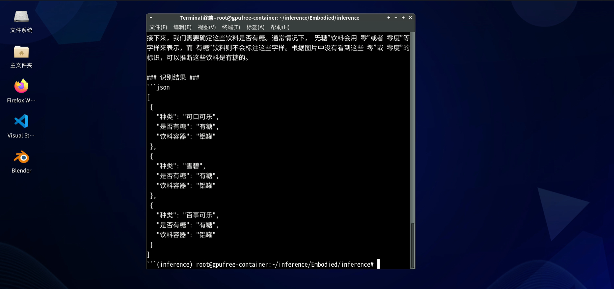

至此，环境测试完毕，关闭所有终端。

## （六）启动仿真

需要多个终端窗口：

**终端一：**

```bash
roscore     
```

**终端二：**

```bash
cd /root/EAICON
chmod +x run_go2_sim.sh
bash run_go2_sim.sh
```

此时需耐心等待Isaac Sim加载成功，直到画面中出现完整的场景和机器狗，再启动终端三。

启动界面如下图所示：

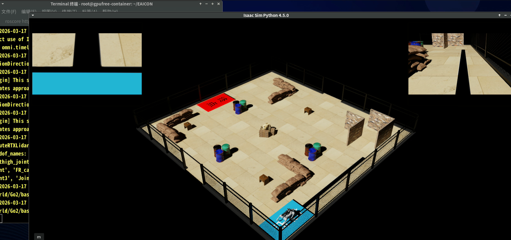

**终端三：**

```bash
#进入工作空间
cd /root/Go2
#运行 launch文件
roslaunch go2_slam go2_bring.launch
```

启动 Rviz 之后，会显示地图及雷达，如下图所示，再点击2D Pose Estimate，之后打开终端四。

注：若 Rviz 启动后，图中只有地图，没有显示雷达点云，需要 ctrl+c 杀死终端二、三，并在终端二、三执行 clear 清除命令，重新执行终端二、三的命令，直至 Rviz 中出现雷达点云，此时点击才可以继续往下执行。

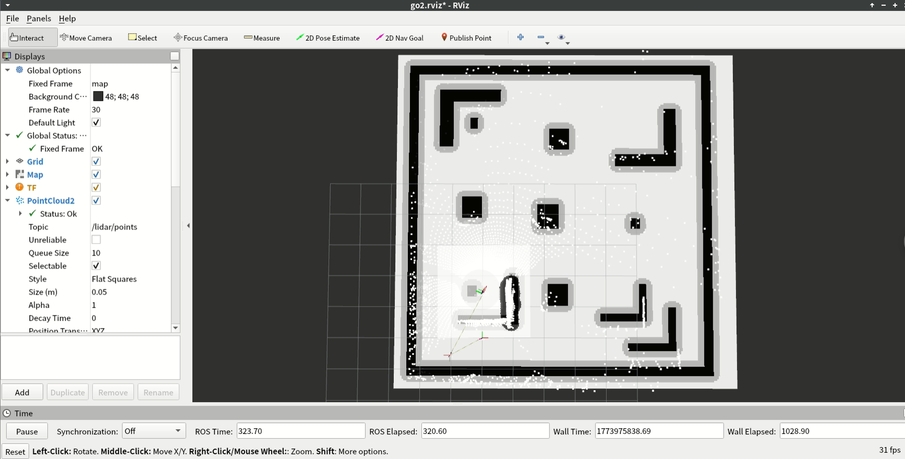

点击2D Pose Estimate， 再点击左下角滑动箭头，给予初始位姿，让雷达能够精准匹配到地图。

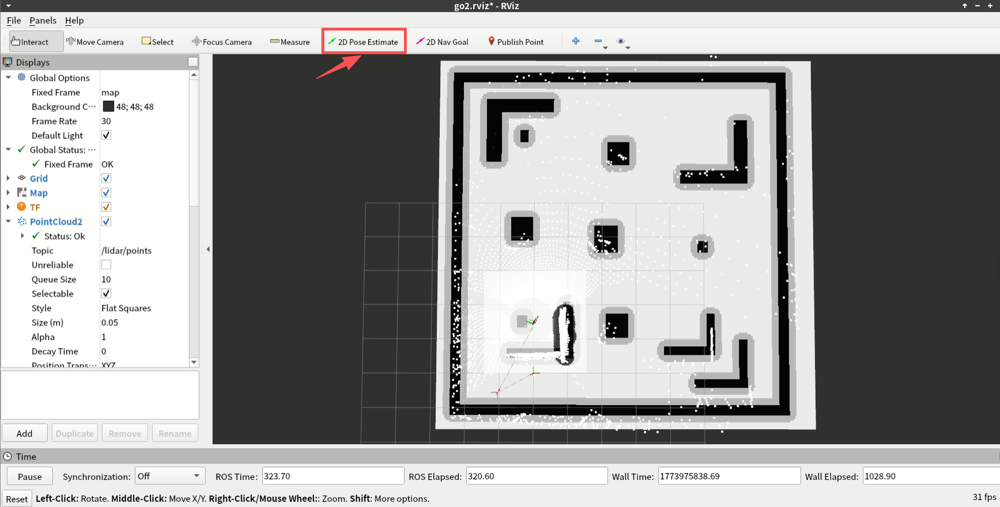

**终端四：**

在执行终端四命令之前，需要修改两处路径。

**修改一：**

先找到`/root/Go2/devel/lib/go2_scale/`下的`go2_scale.py`文件，修改conda inference python环境，即修改Python 路径，将路径修改为`#!/opt/conda/envs/inference/bin/python`，若已修改，关闭该窗口即可。

注：每次编译之后，需要修改此处。

如图：

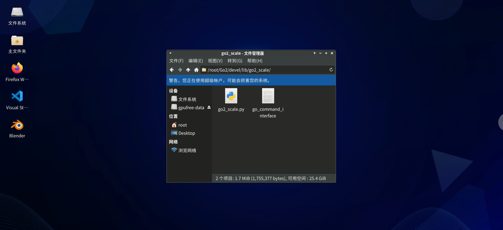

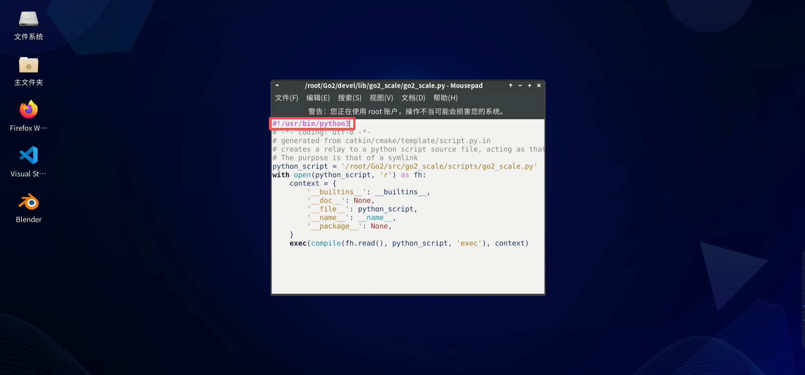

修改为下图：

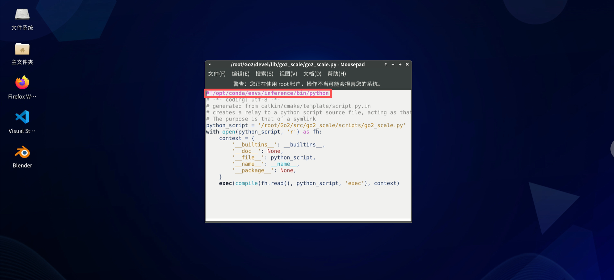

修改完毕之后，Ctrl+s 保存。

修改二：

找到 `/root/Go2/src/go2_scale/scripts/`下的 `go2_scale.py` ，将`self._load_model` 中的 `"/home/q/model/FM9G4B-V"`修改为：`"/root/inference/FM9G4B-V"`，若已经修改，关闭该窗口即可。如下图所示：

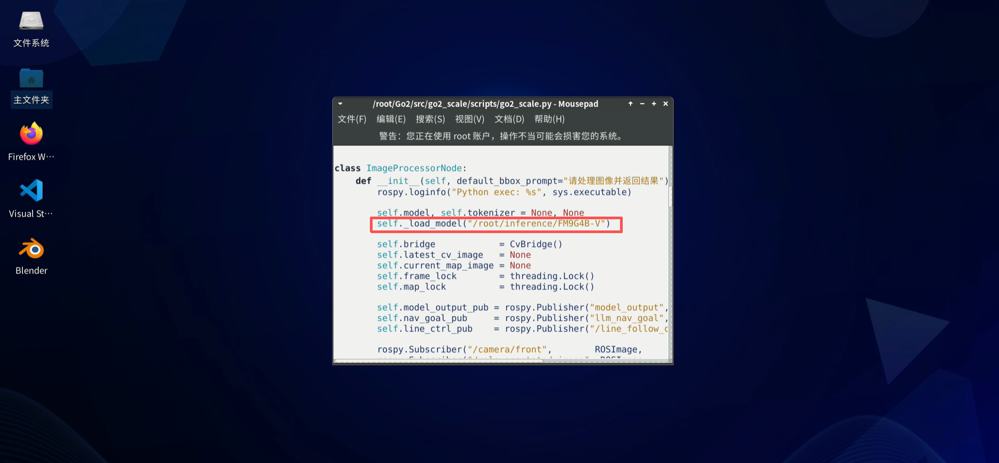修改完毕之后，Ctrl+s 保存。

再打开终端四：

```bash
#进入工作空间
cd Go2
#激活 inference 环境
conda activate inference
#运行 Python文件
rosrun go2_scale go2_scale.py
```

此时成功启动大模型，通过大模型发布话题，控制机器狗运动，将会显示如下界面：

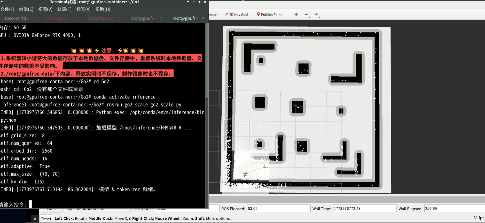

示例：输入导航到终点，将会在 Rviz 中显示大模型规划的路径，在 Isaac Sim 中机器狗会开始导航到终点，图中机器狗已经成功到达终点。

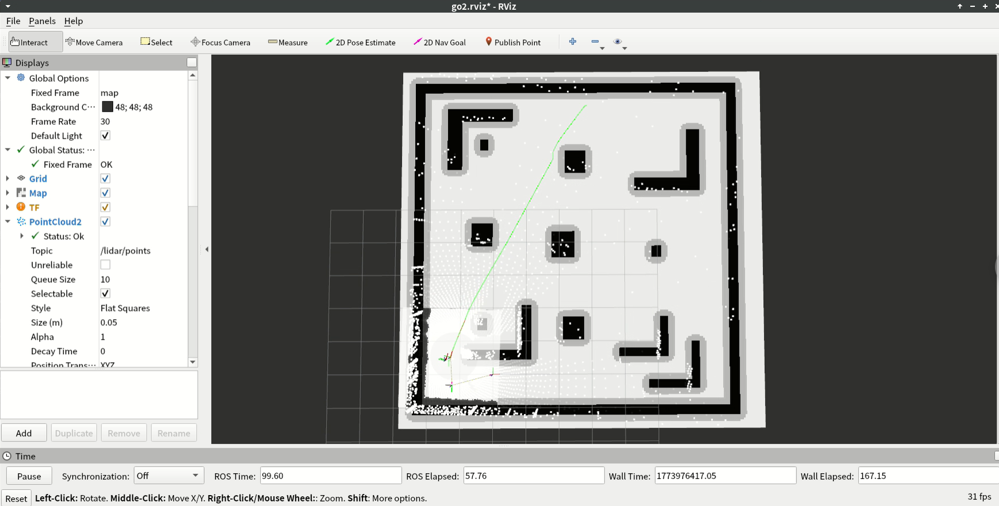

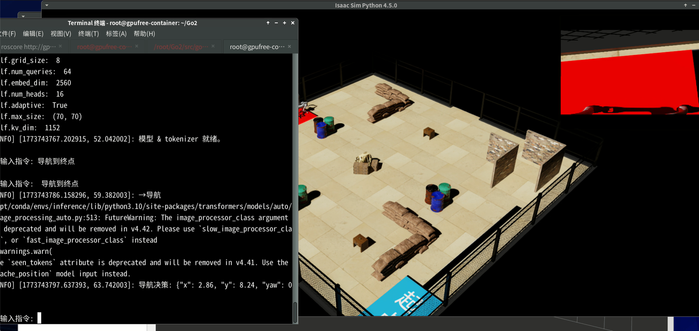

终端五：

修改`/root/Go2/lib/go_arm` 下的`go2_yolov8.py`，修改Python路径为：`#!/opt/conda/envs/yolov8/bin/python`。若已修改，关闭该窗口即可。

注：每次编译之后，都需修改此处。

如下图：

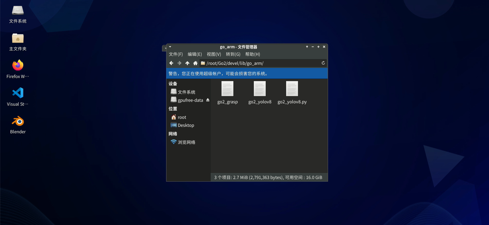

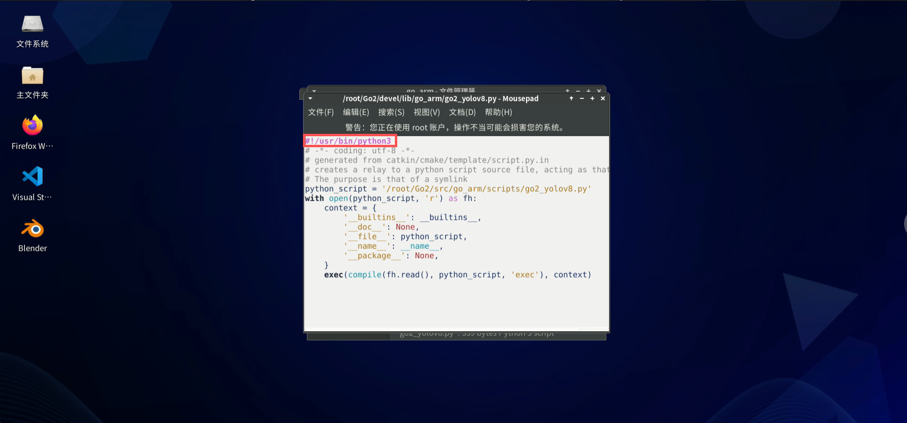

修改为：

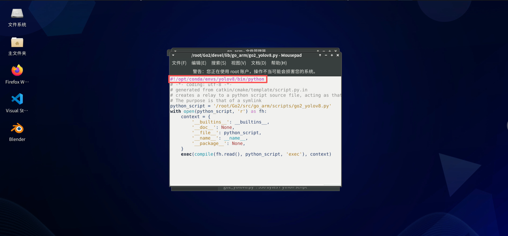

修改完毕之后，Ctrl+s 保存。

打开终端五：

```bash
cd/root/Go2
conda activate yolov8
rosrun go_arm go2_yolov8.py
```

若执行第三条命令时出现报错，请先执行以下命令：

```bash
pip install rospkg
pip install opencv-python
```

等待命令执行完毕，再运行脚本文件：

```bash
rosrun go_arm go2_yolov8.py
```

此时可看到 yolo 界面：

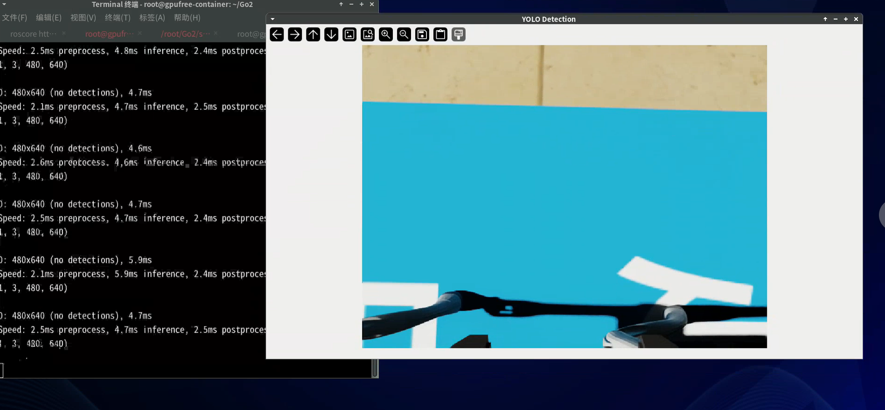示例：将机器狗导航至手电筒的桌子，并抓取手电筒。获取手电筒的位置并抓取

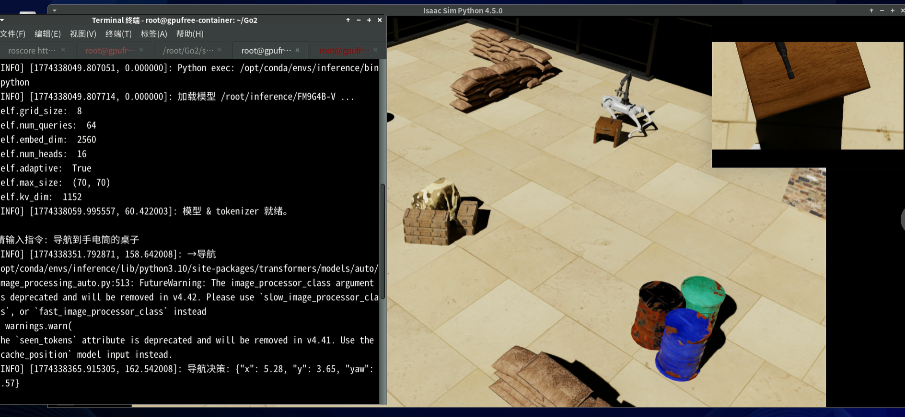

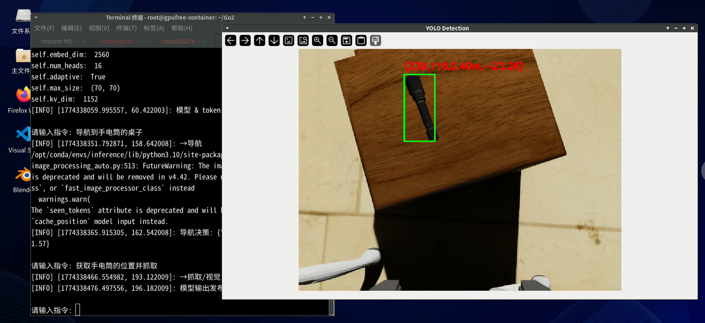

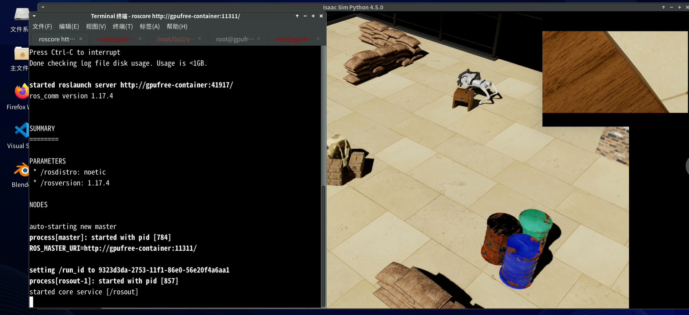

图中显示机器狗已成功识别并且到达手电筒的位置，且 yolo 已检测到手电筒的位置坐标，夹爪已经向下移动并有夹爪闭合的动作。

注：（1）若 yolo 中没有显示位置坐标，需重启终端五，直至 yolo 界面中出现位置坐标。

​        （2）机器狗夹取是否精准，需选手自行优化。

至此，机器狗仿真顺利结束。

## （七）大模型接口

  该版本通用大模型参数量为80亿，具有高效训练与推理和高效适配与部署的技术特点，具备文本问答、文本分类、机器翻译、文本摘要等自然语言处理能力。九格百亿级通用基础大模型的参数量为8B（80亿）。具体的模型训练、推理等内容见：[九格大模型快速开始](https://www.osredm.com/jiuyuan/CPM-9G-8B/tree/master/quick_start_clean/readmes/README_ALL.md)

  本表聚焦“九格”接口设计中与大模型相关的部分，将其抽象为模型加载、推理调用两大核心单元，具体接口列表如下：

| 接口名称     |                      描述                       |                         调用方式                          |                           输入参数                           |                          输出                           |                      异常处理                       |
| ------------ | :---------------------------------------------: | :-------------------------------------------------------: | :----------------------------------------------------------: | :-----------------------------------------------------: | :-------------------------------------------------: |
| 模型加载接口 |    从本地或远程路径加载大模型及其 Tokenizer     | `AutoModel.from_pretrained AutoTokenizer.from_pretrained` | `model_file` (字符串)：权重与配置存放路径 `trust_remote_code` (布尔)：是否信任远程自定义代码 | `self.model` (模型对象) - `self.tokenizer` (分词器对象) | 捕获并 `rospy.logerr`，加载失败时置空并退出订阅流程 |
| 推理调用接口 | 根据输入图像与文本 Prompt，调用模型生成推理结果 | `model.chat(image=None, msgs, tokenizer=self.tokenizer)`  |                  `msgs` (列表)：每项为字典                   |                                                         |                                                     |

### 1.模型加载接口

```python
  self.model = AutoModel.from_pretrained(
      model_file: str,
      trust_remote_code: bool = True,
      attn_implementation: str = 'sdpa',
      torch_dtype: torch.dtype = torch.bfloat16
  )
  self.tokenizer = AutoTokenizer.from_pretrained(
      model_file: str,
      trust_remote_code: bool = True
  )
```

（1）参数说明

 `model_file`：本地或远程路径，预训练模型权重与配置所在目录。

 `trust_remote_code`：是否信任并执行仓库中的自定义代码。

 `attn_implementation` 与 `torch_dtype`：可选优化参数。

（2）输出说明

 `self.model`：已加载并 eval() 的模型实例，已切换到 CUDA（若可用）。

 `self.tokenizer`：对应的分词器，用于构造输入tokens。

（3）异常处理

 捕获任何加载错误，调用 `rospy.logerr`(“模型加载失败: %s”, e) 并将`self.model/self.tokenizer` 置为 None，后续流程根据空值判断跳过订阅与推理。

### 2.推理调用接口

```python
model_res = self.model.chat(
    image=None,
    msgs: List[Dict[str, Any]],
    tokenizer=self.tokenizer
)
```

（1）输入说明：

 `msgs`：长度可变的消息列表，每条消息格式为：

```python
{
  'role': 'user',
  'content': [pil_image: PIL.Image.Image, prompt: str]
}
```

 `pil_image`：从最新 ROS 彩色帧转换而来。

 `prompt`：用户或上层脚本动态输入的文本提示。

（2）输出说明：

 `model_res`：大模型返回的推理结果，可为文本、结构化数据或二次封装，随后转换为字符串发布。

（3）调用时机：

 在 `self.new_bbox_request == True` 且最新图像帧已获取时触发。

（4）异常处理：

 推理过程中捕获任何异常并调用 `rospy.logerr`(“调用大模型进行处理时出错: %s”, e)，当前帧推理终止，不影响后续请求。

## （八）四足机器狗接口

### 1.运动控制接口

|    话题名称    |       消息类型        | 发布/订阅 |                           功能说明                           |
| :------------: | :-------------------: | :-------: | :----------------------------------------------------------: |
|   `/cmd_vel`   | `geometry_msgs/Twist` |   订阅    |           接收机器人运动控制指令（线速度和角速度）           |
|  `/cmd_vel_x`  |  `std_msgs/Float32`   |   发布    |                 发布处理后的x方向线速度分量                  |
|  `/cmd_vel_y`  |  `std_msgs/Float32`   |   发布    |                 发布处理后的y方向线速度分量                  |
| `/cmd_vel_yaw` |  `std_msgs/Float32`   |   发布    |                发布处理后的绕z轴的角速度分量                 |
|    `/odom`     |  `nav_msgs/Odometry`  |   发布    |           发布机器人里程计信息（位置、姿态和速度）           |
|     `/tf`      | `tf2_msgs/TFMessage`  |   发布    |             广播各坐标系之间的变换（坐标变换树）             |
| `/go2_posture` |   `std_msgs/String`   |   发布    | 用于控制机械狗两种基础姿态：`stand`：站起 / 保持站立；`down`：趴下，将四足关节过渡到趴下目标位姿 |

### 2.传感器接口

|     话题名称     |         消息类型          | 发布/订阅 |                     功能说明                     |
| :--------------: | :-----------------------: | :-------: | :----------------------------------------------: |
| `/camera/front`  |    `sensor_msgs/Image`    |   订阅    |       前视摄像头原始图像 用于机械狗的巡线        |
| `/camera/global` |    `sensor_msgs/Image`    |   订阅    |                    全局摄像头                    |
| `/lidar/points`  | `sensor_msgs/PointCloud2` |   发布    |                 发布三维点云数据                 |
|     `/scan`      |  `ensor_msgs/LaserScan`   |   发布    |               发布二维激光扫描数据               |
|   `/imu/data`    |     `sensor_msgs/Imu`     |   发布    | 发布惯性测量单元数据，包括线加速度、角速度和姿态 |
