# 2026无人系统具身智能算法挑战赛--无人机搜索打击应用场景使用手册

## 介绍

​	本手册专为" 2026无人系统具身智能算法挑战赛 "中的无人机搜索打击场景应用挑战赛参赛队伍设计，提供完整的大模型-无人机协同开发指导手册。手册围绕"视觉感知-决策控制-无人机执行"的技术闭环，帮助参赛者快速构建基于九格大模型的无人机搜索打击控制系统。

​	本手册采用"理论→工具→实践"的递进式设计，助力参赛团队快速实现"语言指令→场景理解→飞行执行"的智能无人机搜索打击控制闭环，为大赛竞技提供坚实的技术支撑。

```
## 2026无人系统具身智能算法挑战赛 使用手册限制条款

© 2026无人系统具身智能算法挑战赛组委会 版权所有

### **使用授权范围：**  

本手册仅授权以下主体在赛事期间使用：

1. 经组委会认证的参赛团队队员
2. 赛事官方裁判及技术监督人员
3. 组委会授权的培训导师

### **严格禁止事项：**  

-  任何形式的商业性使用或二次销售  
-  向非参赛组织或个人进行传播  
-  改编后用于其他赛事或商业项目  
-  在线平台/文库的公开传播  

### **使用约束：**  

手册所含技术方案、赛事规则及数据参数等知识产权归组委会所有，参赛者仅限：

-  赛事筹备期用于技术方案设计参考
-  正式竞赛期间作为操作规范依据
-  赛后总结阶段用于技术复盘分析

### **免责声明：**  

 本手册内容按"现有状态"提供：
 组委会不承担因手册信息导致的技术方案偏差责任  
 不保证所含方案满足特定技术场景的实施需求  
 对使用后果不承担直接或间接法律责任  

*违反本条款者组委会有权取消参赛资格并追究法律责任*
```


## 仿真部分

## **（一）进入镜像**

点击链接[TCEI 2026 无人机空地协同搜索打击赛 - 算力自由](https://www.gpufree.cn/images/101310)，可直接进入镜像选择界面，然后点击立即创建


初次使用算力自由平台，可以参看平台[快速开始](https://www.gpufree.cn/docs/guide/quick_start.html)https://www.gpufree.cn/docs/guide/quick_start.html文档。

专用镜像体积较大，可能需要较长的拉取时间，需要几分钟或者十几分钟的等待。开机过程是不会收取算力费用的。创建成功之后进入控制台，从控制台进入远程桌面。


点击进入远程桌面。


为了方便文字的复制粘贴，授权，找到浏览器网页授权图标，比如Edge界面

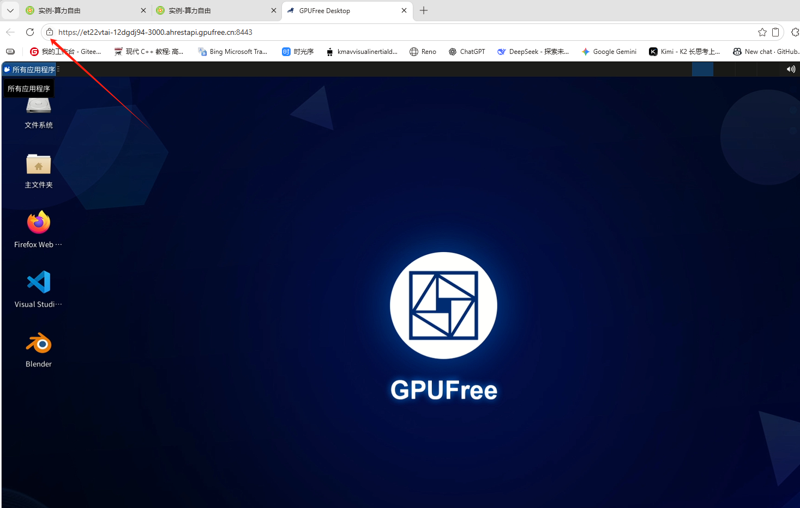

选择授权

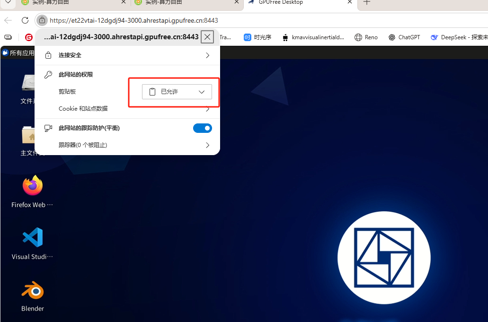

## （二）ROS 1环境

进入远程桌面之后，先检查环境，ROS 1环境是已经预装的，在快速启动中包括了它的启动方式：

直接开启三个终端：

**终端一：**

```bash
roscore     
```

**终端二：**

```bash
rosrun turtlesim turtlesim_node
```

**终端三：**

```bash
rosrun turtlesim turtle_teleop_key
```

结果输出：

使用键盘上下左右操作，可以看到界面上的小乌龟在按照键盘指令移动。测试完成后可以关闭终端一二三。

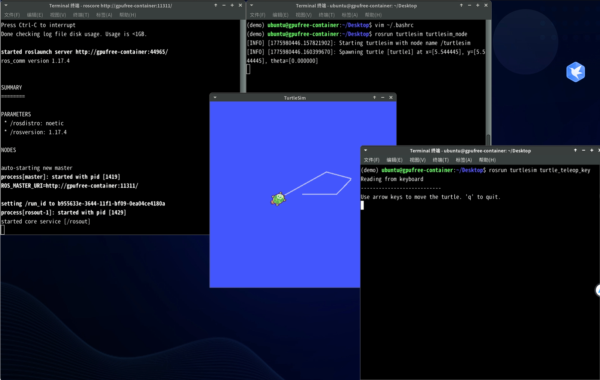

## (三) MavROS环境

运行下面命令

```bash
roslaunch mavros px4.launch 
```

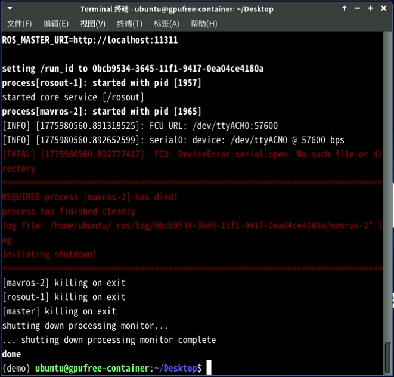

这个报错可以忽略，因为我们使用默认的串口方式运行mavros,所以报错，在实际的仿真里面使用UDP通信方式。

## (四) RflySim平台环境

运行下面的启动RflySim平台的三个软件

```bash
 cd ~/PX4PSP && ./SITLRun.sh
```

运行后会启动三个软件

CopterSim软件

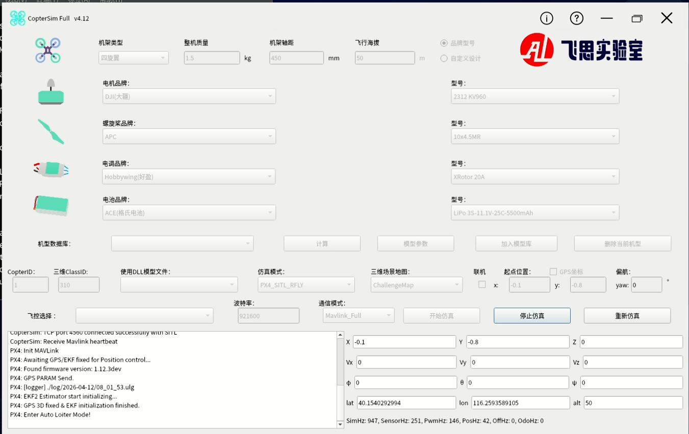

QGroundControl软件

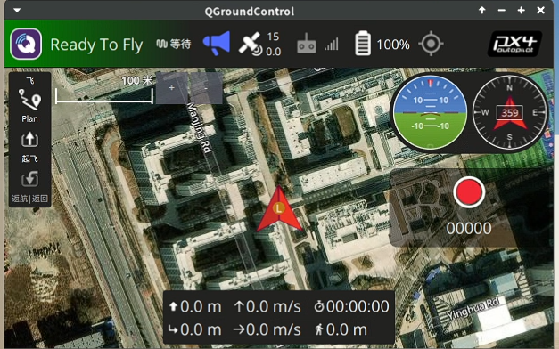

RflySim3D 软件

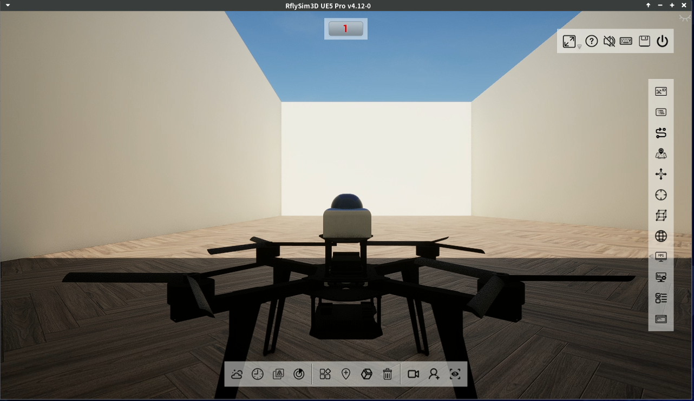


## （五）检查文件

比赛的环境包括了：

- demo源代码，路径存放在/home/nvidia/catkin_ws里面

  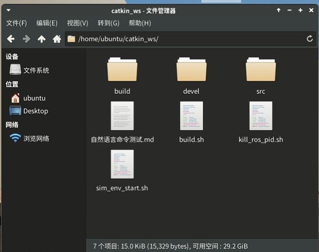

  这个源码包括，行为树模块，目标检测模块，路径规划模块，以及传感器配置模块

  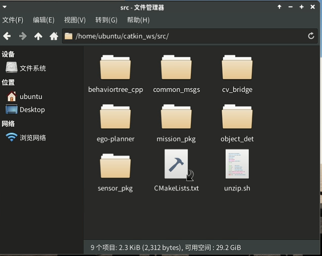

- 九格大模型

  九格大模型放在/home/ubuntu/model目录下，跑的是一个4B的模型，4B模型对当前任务已经足够了。

  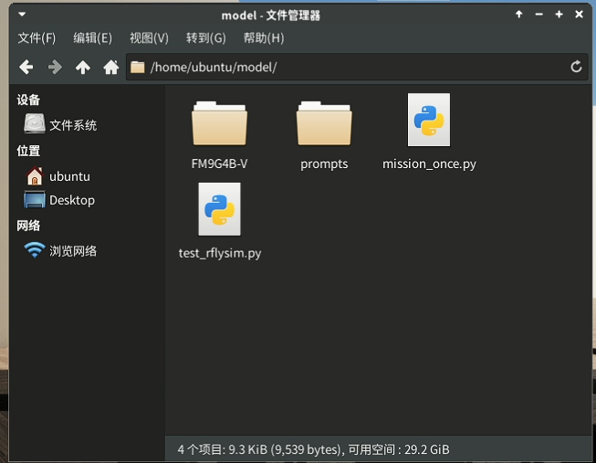

## (六) demo 测试

假设已经运行了平台，如果还没有运行，就参考第四章内容。等到飞机位置初始化完成即可运行demo程序，飞机位置初始化完成的判断依据

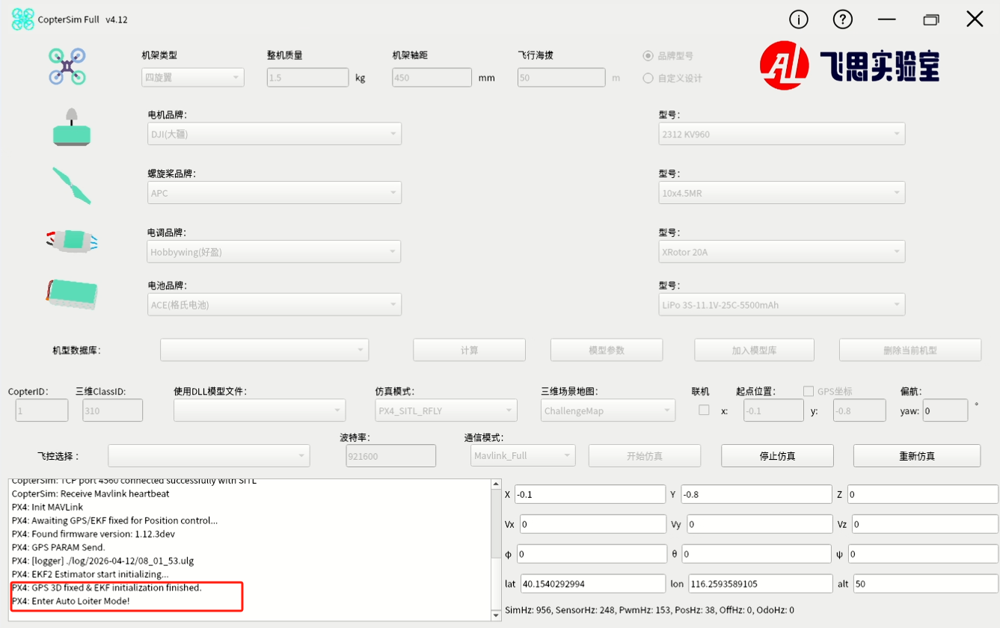

等到CopterSim 软件窗口左下角出现“GPS 3D fixed ...” 字样就表示飞机位置初始化完成了。

运行demo 代码

```bash
cd ~/catkin_ws && ./sim_env_start.sh
```

运行上面的脚本后，所有程序都将运行起来，首先会看到Xterm启动了七个窗口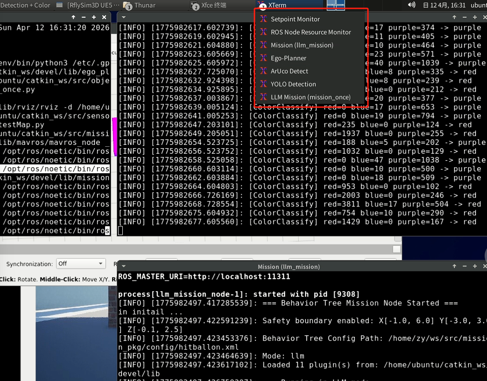

前面两个终端setpoint monitor 和 ros node resource monitor 分别是调试使用的，用来查看发给飞机的控制指令和 ROS 各节点运行的资源消耗

- Mission(llm_mission)为行为树控制节点

- Ego-Planner 为路径规划节点

- ArUco Detect 为二维码检测节点

- Yolo Detection 为目标检测节点

- LLM Mission 为启动大模型节点

  下面贴出代码启动后效果

首先会看到场景创建，三辆小车会在轨迹上不定速度行驶

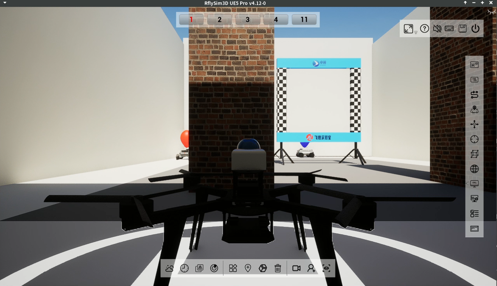

目标检测程序启动

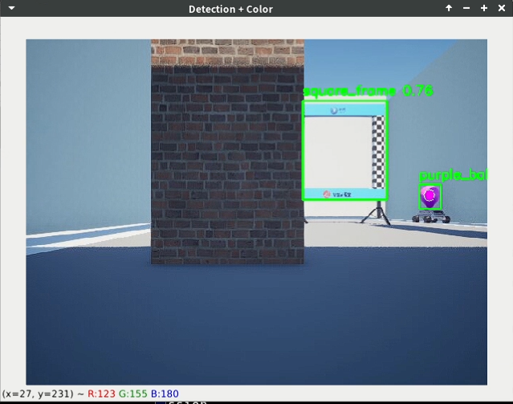

路径规划程序启动

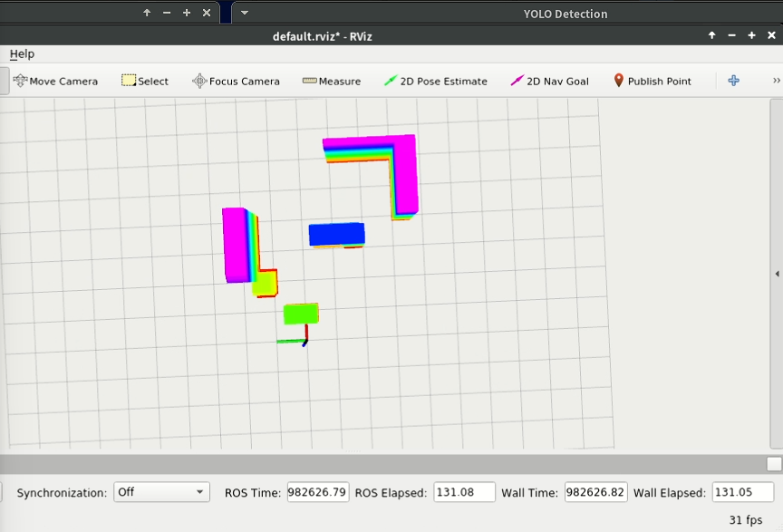

大模型调用启动端口

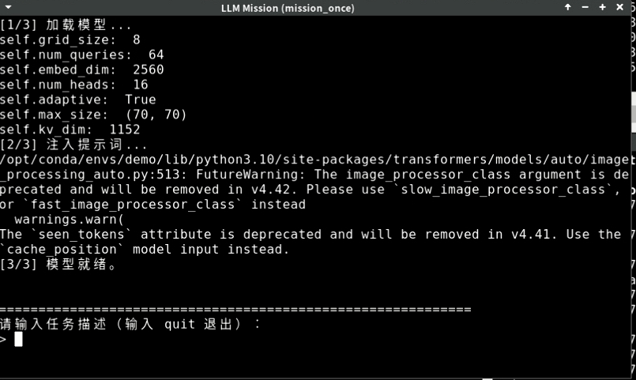

二维码启动端口

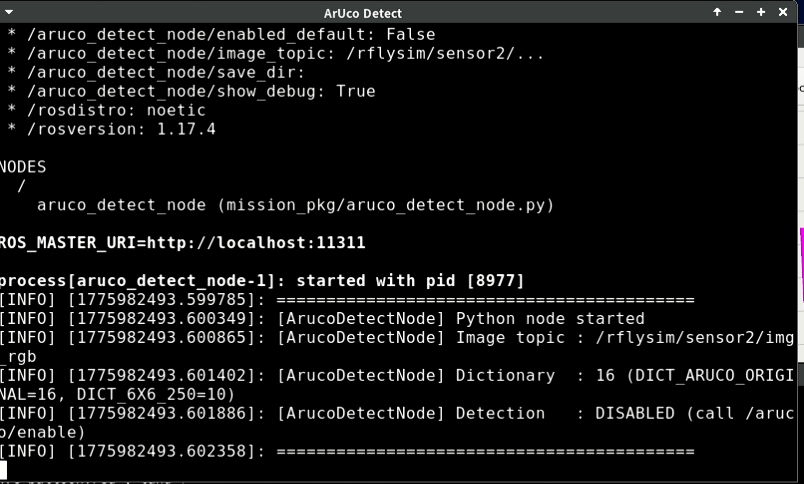

行为树节点启动端口

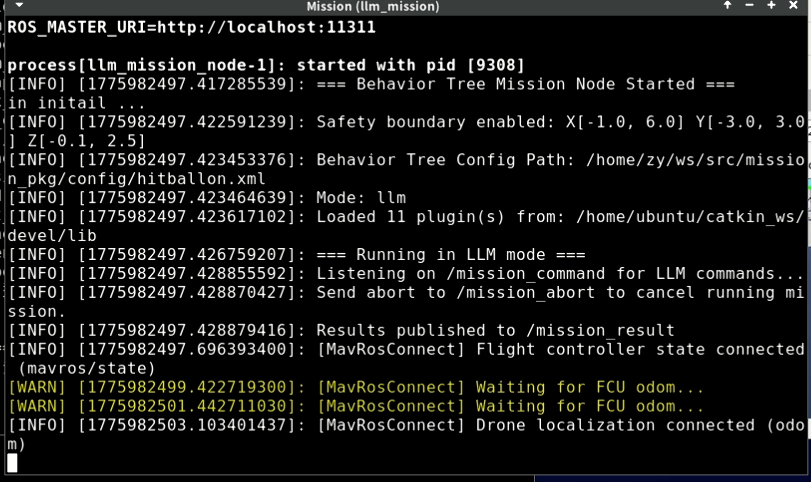

打开/home/ubuntu/catkin_ws/自然语言命令测试.md文档

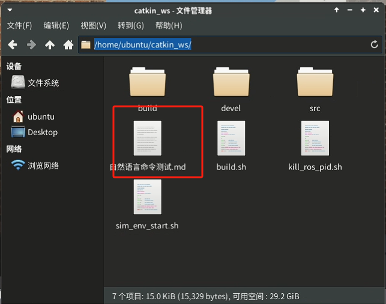

任意复制一条示例指令，如打击红色气球“飞机起飞，然后穿过框，再去识别二维码，然后再穿回框，接着去打击红色气球，完成后就回到起点并降落；”， 按shift + ctrl + v 键进行粘贴，回车后。大模型就进行推理，并发指令给行为树控制节点生成对应的行为树

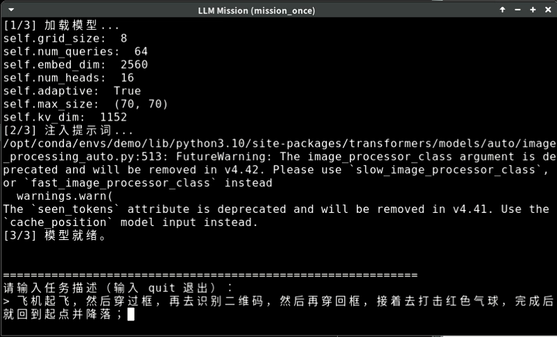

回车后等待十秒左右后，飞机即可起飞，并且按照大模型生成的指令完成任务。

## （七）接口说明

### 1. 大模型接口

大模型相关代码位于 `/home/ubuntu/catkin_ws/multi/multi/` 目录下，核心文件结构如下：

```
multi/multi/
├── FM9G4B-V/              # 九格 4B 模型权重与配置
├── prompts/               # 提示词模板
│   ├── mission_prompt.txt # 任务生成提示词
│   ├── system_promt.txt   # 系统提示词
│   └── basic_cn.txt       # 基础中文提示词
├── mission_once.py        # 一次性任务生成脚本（主入口）
└── test_rflysim.py        # RflySim 测试脚本
```

该版本通用大模型参数量为80亿（8B），具有高效训练与推理和高效适配与部署的技术特点，具备文本问答、文本分类、机器翻译、文本摘要等自然语言处理能力。具体的模型训练、推理等内容见：[九格大模型快速开始](https://www.osredm.com/jiuyuan/CPM-9G-8B/tree/master/quick_start_clean/readmes/README_ALL.md)

本表聚焦"九格"接口设计中与大模型相关的部分，将其抽象为模型加载、推理调用两大核心单元，具体接口列表如下：

| 接口名称     |                      描述                       |                         调用方式                          |                           输入参数                           |                          输出                           |                      异常处理                       |
| ------------ | :---------------------------------------------: | :-------------------------------------------------------: | :----------------------------------------------------------: | :-----------------------------------------------------: | :-------------------------------------------------: |
| 模型加载接口 |    从本地或远程路径加载大模型及其 Tokenizer     | `AutoModel.from_pretrained AutoTokenizer.from_pretrained` | `model_file` (字符串)：权重与配置存放路径 `trust_remote_code` (布尔)：是否信任远程自定义代码 | `self.model` (模型对象) - `self.tokenizer` (分词器对象) | 捕获并 `rospy.logerr`，加载失败时置空并退出订阅流程 |
| 推理调用接口 | 根据输入图像与文本 Prompt，调用模型生成推理结果 | `model.chat(image=None, msgs, tokenizer=self.tokenizer)`  |                  `msgs` (列表)：每项为字典                   |                                                         |                                                     |

#### 1.1 模型加载接口

```python
self.model = AutoModel.from_pretrained(
    model_file: str,
    trust_remote_code: bool = True,
    attn_implementation: str = 'sdpa',
    torch_dtype: torch.dtype = torch.bfloat16
)
self.tokenizer = AutoTokenizer.from_pretrained(
    model_file: str,
    trust_remote_code: bool = True
)
```

（1）参数说明

 `model_file`：本地或远程路径，预训练模型权重与配置所在目录。

 `trust_remote_code`：是否信任并执行仓库中的自定义代码。

 `attn_implementation` 与 `torch_dtype`：可选优化参数。

（2）输出说明

 `self.model`：已加载并 eval() 的模型实例，已切换到 CUDA（若可用）。

 `self.tokenizer`：对应的分词器，用于构造输入tokens。

（3）异常处理

 捕获任何加载错误，调用 `rospy.logerr`("模型加载失败: %s", e) 并将`self.model/self.tokenizer` 置为 None，后续流程根据空值判断跳过订阅与推理。

#### 1.2 推理调用接口

```python
model_res = self.model.chat(
    image=None,
    msgs: List[Dict[str, Any]],
    tokenizer=self.tokenizer
)
```

（1）输入说明

 `msgs`：长度可变的消息列表，每条消息格式为：

```python
{
  'role': 'user',
  'content': [pil_image: PIL.Image.Image, prompt: str]
}
```

 `pil_image`：从最新 ROS 彩色帧转换而来。

 `prompt`：用户或上层脚本动态输入的文本提示。

（2）输出说明

 `model_res`：大模型返回的推理结果，可为文本、结构化数据或二次封装，随后转换为字符串发布。

（3）调用时机

 在 `self.new_bbox_request == True` 且最新图像帧已获取时触发。

（4）异常处理

 推理过程中捕获任何异常并调用 `rospy.logerr`("调用大模型进行处理时出错: %s", e)，当前帧推理终止，不影响后续请求。

#### 1.3 任务生成工作流

大模型的主入口脚本为 `mission_once.py`，其工作流程如下：

1. **加载模型**：从 `FM9G4B-V/` 目录加载九格 4B 模型权重
2. **注入提示词**：读取 `prompts/mission_prompt.txt`，完成上下文注入
3. **任务交互**：接收用户自然语言任务描述，大模型推理生成行为指令序列
4. **指令发送**：将生成的指令序列通过 ROS 话题 `/mission_command`（`std_msgs/String`）发送给行为树控制节点

使用方式：

```bash
# 命令行方式
python3 mission_once.py "起飞，穿过框，识别二维码，再穿回来，去A区打红色气球，降落"

# 交互式方式
python3 mission_once.py
```

### 2. 行为树与任务话题

大模型生成的指令通过以下话题与行为树系统交互：

| 话题名称             | 消息类型          | 方向     | 功能说明                                   |
| :------------------- | :---------------- | :------- | :----------------------------------------- |
| `/mission_command`   | `std_msgs/String` | 大模型→行为树 | 大模型生成的指令序列，驱动行为树执行任务   |
| `/mission_result`    | `std_msgs/String` | 行为树→外部   | 任务执行结果反馈                           |
| `/move_base_simple/goal` | `geometry_msgs/PoseStamped` | 行为树→规划器 | 下发导航目标点给路径规划器（Ego-Planner） |
| `/planning/pos_cmd`  | 自定义            | 规划器→行为树 | 路径规划器输出的位置指令                   |
| `/objects`           | `common_msgs/Objects` | 检测→行为树 | 目标检测结果（YOLO / HSV / ArUco）         |

## （八）无人机控制接口（MAVROS）

无人机的飞行控制通过 MAVROS 实现，MAVROS 是 MAVLink 协议的 ROS 封装，用于 ROS 节点与 PX4 飞控之间的通信。在本比赛环境中，MAVROS 通过 UDP 方式与仿真飞控连接。

控制接口的核心封装位于 `mission_pkg` 中的 `MavRosConnect` 类（`mavros_cnt.h / mavros_cnt.cpp`），采用单例模式统一管理无人机状态、定位和控制指令。

### 1. 状态订阅话题

| 话题名称                       | 消息类型               | 方向   | 功能说明                                                     |
| :----------------------------- | :--------------------- | :----- | :----------------------------------------------------------- |
| `/mavros/state`                | `mavros_msgs/State`    | 订阅   | 飞控连接状态，包括 `connected`（是否连接）、`armed`（是否解锁）、`mode`（飞行模式，如 `OFFBOARD`） |
| `/mavros/local_position/odom`  | `nav_msgs/Odometry`    | 订阅   | 飞控本地里程计数据，包含位置（ENU坐标）、姿态（四元数）、线速度和角速度 |

### 2. 控制指令发布话题

| 话题名称                       | 消息类型                       | 方向   | 功能说明                                                     |
| :----------------------------- | :----------------------------- | :----- | :----------------------------------------------------------- |
| `/mavros/setpoint_raw/local`   | `mavros_msgs/PositionTarget`   | 发布   | 发布位置/速度/加速度控制指令，支持 ENU 世界坐标系和 body 机体坐标系 |

`PositionTarget` 消息是无人机控制的核心接口，通过 `type_mask` 位掩码选择控制维度，通过 `coordinate_frame` 选择坐标系。

#### 2.1 位置控制模式（世界坐标系）

用于导航到指定的 ENU 世界坐标点，行为树中用于航点飞行、起飞悬停等：

```python
from mavros_msgs.msg import PositionTarget

cmd = PositionTarget()
cmd.coordinate_frame = PositionTarget.FRAME_LOCAL_NED
cmd.type_mask = (
    PositionTarget.IGNORE_VX | PositionTarget.IGNORE_VY |
    PositionTarget.IGNORE_VZ | PositionTarget.IGNORE_AFX |
    PositionTarget.IGNORE_AFY | PositionTarget.IGNORE_AFZ |
    PositionTarget.IGNORE_YAW_RATE | PositionTarget.FORCE
)
cmd.position.x = target_x   # ENU 东向 (m)
cmd.position.y = target_y   # ENU 北向 (m)
cmd.position.z = target_z   # ENU 天向 (m)
cmd.yaw = target_yaw        # 目标航向 (rad)
```

#### 2.2 速度控制模式（机体坐标系）

用于视觉伺服等需要在机体坐标系下控制的场景，如追踪气球时的前向速度+偏航角速度控制：

```python
cmd = PositionTarget()
cmd.coordinate_frame = PositionTarget.FRAME_BODY_NED
cmd.type_mask = (
    PositionTarget.IGNORE_PX | PositionTarget.IGNORE_PY |
    PositionTarget.IGNORE_PZ | PositionTarget.IGNORE_AFX |
    PositionTarget.IGNORE_AFY | PositionTarget.IGNORE_AFZ |
    PositionTarget.IGNORE_YAW | PositionTarget.IGNORE_VY
)
cmd.velocity.x = forward_vel   # 机体前向速度 (m/s)
cmd.velocity.y = 0.0           # 机体侧向速度 (m/s)
cmd.velocity.z = vertical_vel  # 垂直速度 (m/s)
cmd.yaw_rate = yaw_rate        # 偏航角速度 (rad/s)
```

#### 2.3 type_mask 位掩码说明

| 掩码常量                              | 值     | 说明                          |
| :------------------------------------ | :----- | :---------------------------- |
| `IGNORE_PX / IGNORE_PY / IGNORE_PZ`  | 1/2/4  | 忽略位置分量                  |
| `IGNORE_VX / IGNORE_VY / IGNORE_VZ`  | 8/16/32 | 忽略速度分量                  |
| `IGNORE_AFX / IGNORE_AFY / IGNORE_AFZ` | 64/128/256 | 忽略加速度分量                |
| `IGNORE_YAW`                          | 1024   | 忽略航向角                    |
| `IGNORE_YAW_RATE`                     | 2048   | 忽略航向角速度                |
| `FORCE`                               | 512    | 将加速度解释为力              |

### 3. 飞控服务接口

| 服务名称              | 服务类型                    | 功能说明                                                     |
| :-------------------- | :-------------------------- | :----------------------------------------------------------- |
| `/mavros/set_mode`    | `mavros_msgs/SetMode`       | 设置飞行模式，如切换到 `OFFBOARD` 模式以接受外部控制指令     |
| `/mavros/cmd/arming`  | `mavros_msgs/CommandBool`   | 解锁/上锁电机，`True` 解锁使电机可以响应油门指令             |

#### 3.1 飞行模式切换

```python
from mavros_msgs.srv import SetMode

set_mode_client = rospy.ServiceProxy('/mavros/set_mode', SetMode)
# 切换到 OFFBOARD 模式
resp = set_mode_client(custom_mode='OFFBOARD')
```

#### 3.2 电机解锁

```python
from mavros_msgs.srv import CommandBool

arming_client = rospy.ServiceProxy('/mavros/cmd/arming', CommandBool)
# 解锁电机
resp = arming_client(value=True)
```

> **注意**：在切换到 OFFBOARD 模式之前，必须先以足够频率（>2Hz）向 `/mavros/setpoint_raw/local` 发布控制指令，否则飞控会拒绝切换。demo 代码中 `MavRosConnect` 类的 `cmdPublishLoop` 以 50Hz (0.02s) 定时发布控制指令来满足此要求。

### 4. 安全边界保护

`MavRosConnect` 内置了安全边界检查机制，当无人机超出预设的安全飞行区域时，将自动切换为悬停模式。安全边界参数通过 launch 文件配置：

```xml
<param name="safety/enabled" value="true" type="bool"/>
<param name="safety/x_min" value="-1.0" type="double"/>
<param name="safety/x_max" value="6.0" type="double"/>
<param name="safety/y_min" value="-3.0" type="double"/>
<param name="safety/y_max" value="3.0" type="double"/>
<param name="safety/z_min" value="-0.1" type="double"/>
<param name="safety/z_max" value="2.5" type="double"/>
```

## （九）传感器配置

传感器相关代码位于 `/home/ubuntu/catkin_ws/src/sensor_pkg/` 目录下，主要负责 RflySim 仿真平台的传感器数据获取与 ROS 话题转发。

### 1. 传感器配置文件

传感器配置通过 `sensor_pkg/Config.json` 文件定义，当前配置了 3 个视觉传感器：

| SeqID | TypeID | 分辨率   | FOV  | 安装位置 (m)       | 安装角度 (°)     | UDP端口 | 说明                 |
| :---- | :----- | :------- | :--- | :----------------- | :--------------- | :------ | :------------------- |
| 0     | 7      | 640×640  | 80°  | [0.2, 0, 0] 前向   | [0, 0, 0]        | 9999    | 深度传感器（Depth）  |
| 1     | 1      | 640×480  | 90°  | [0.2, 0, 0] 前向   | [0, 0, 0]        | 9998    | 前向 RGB 摄像头      |
| 2     | 1      | 640×480  | 90°  | [0, 0, 0] 机体中心 | [0, -90, 0] 下视 | 9996    | 下视 RGB 摄像头      |

**TypeID 说明**：`1` = RGB 彩色相机，`7` = 深度传感器

Config.json 配置示例：

```json
{
    "VisionSensors":[
        {
            "SeqID": 0,
            "TypeID": 7,
            "DataWidth": 640,
            "DataHeight": 640,
            "DataCheckFreq": 10,
            "CameraFOV": 80,
            "SensorPosXYZ": [0.2, 0, 0],
            "SensorAngEular": [0, 0, 0]
        }
    ]
}
```

**主要配置字段**：

- `SensorPosXYZ`：传感器在机体坐标系下的安装位置偏移 [x, y, z]（单位：米）
- `SensorAngEular`：传感器在机体坐标系下的安装欧拉角 [roll, pitch, yaw]（单位：度）
- `DataCheckFreq`：数据采集频率（Hz）
- `CameraFOV`：相机视场角（度）
- `SendProtocol`：UDP 数据传输协议配置，其中端口号位于第6个字段

### 2. 仿真传感器话题

传感器数据通过 RflySim 平台采集后，以 ROS 话题形式发布：

| 话题名称                         | 消息类型                    | 功能说明                           |
| :------------------------------- | :-------------------------- | :--------------------------------- |
| `/rflysim/sensor0/Depth_Cloud`   | `sensor_msgs/PointCloud2`   | 深度传感器生成的三维点云数据       |
| `/rflysim/sensor1/image_rgb`               | `sensor_msgs/Image`         | 前向 RGB 摄像头图像（用于目标检测）|
| `/rflysim/sensor2/image_rgb`               | `sensor_msgs/Image`         | 下视 RGB 摄像头图像（用于二维码识别）|
| `/rflysim/uav1/local/odom`       | `nav_msgs/Odometry`         | RflySim 提供的无人机真值里程计     |
| `/cloud_registered`              | `sensor_msgs/PointCloud2`   | 经坐标变换后的 world 系点云（供路径规划使用） |

### 3. 点云坐标变换节点

`cloud_transform_node.py` 负责将深度传感器的原始点云从传感器局部坐标系转换到世界坐标系，供 Ego-Planner 路径规划器使用。启动方式：

```bash
roslaunch sensor_pkg cloud_transform.launch
```

配置参数通过 launch 文件设定，核心参数包括传感器外参（来自 `Config.json`）和输入/输出话题名。

### 4. RflySim 仿真平台传感器说明

关于 Config.json 传感器配置文件的具体说明请参考

[RflySimSDK: 1.支持的外部传感器类型](https://rflysim.com/doc/zh/RflySimAPIs/RflySimSDK/html/md_vision_2md_2VisionConfig.html)
