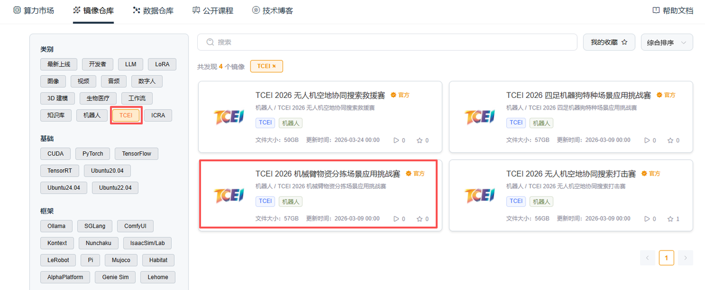
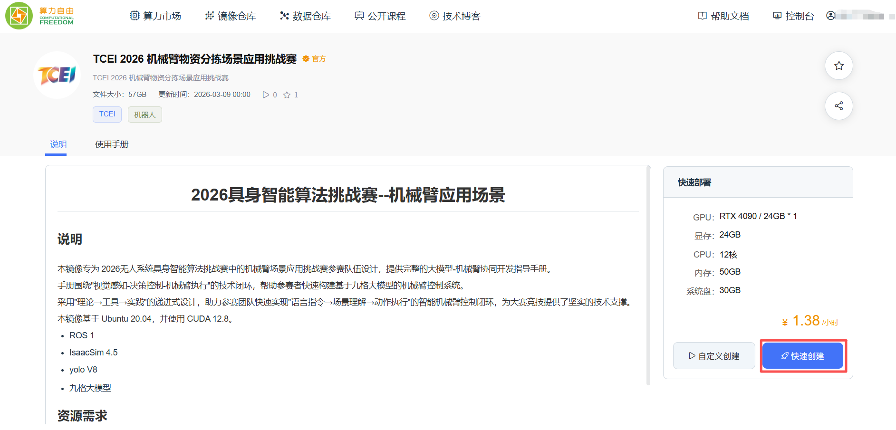
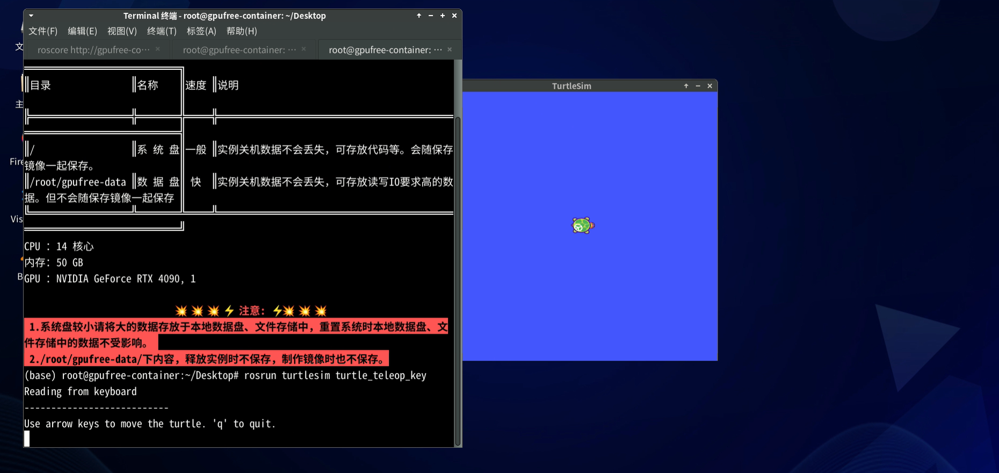
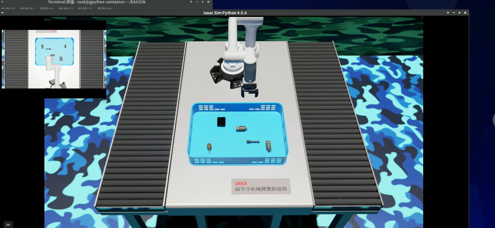
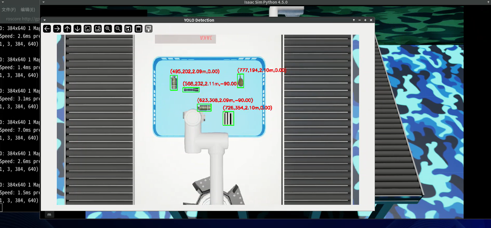
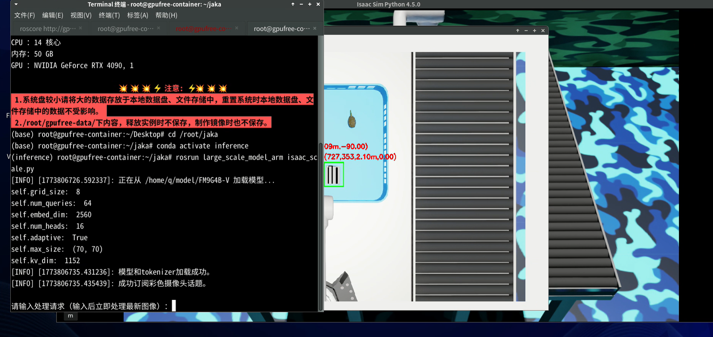
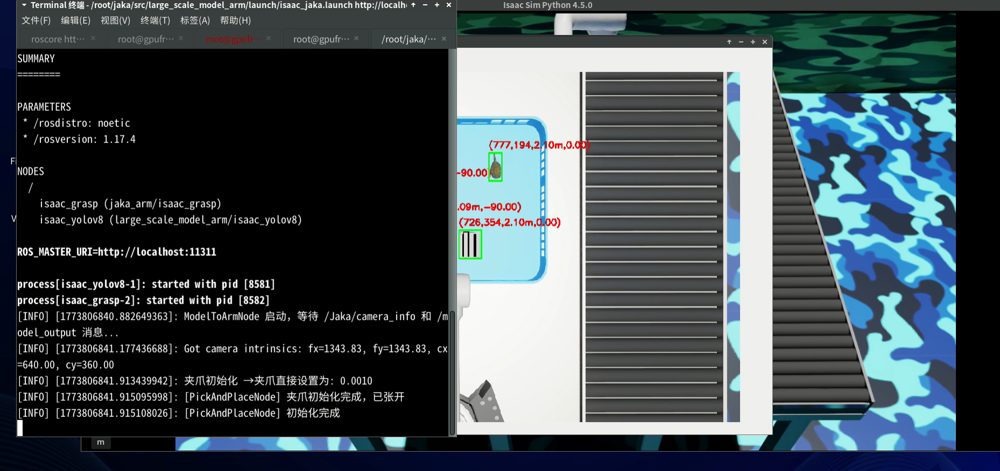
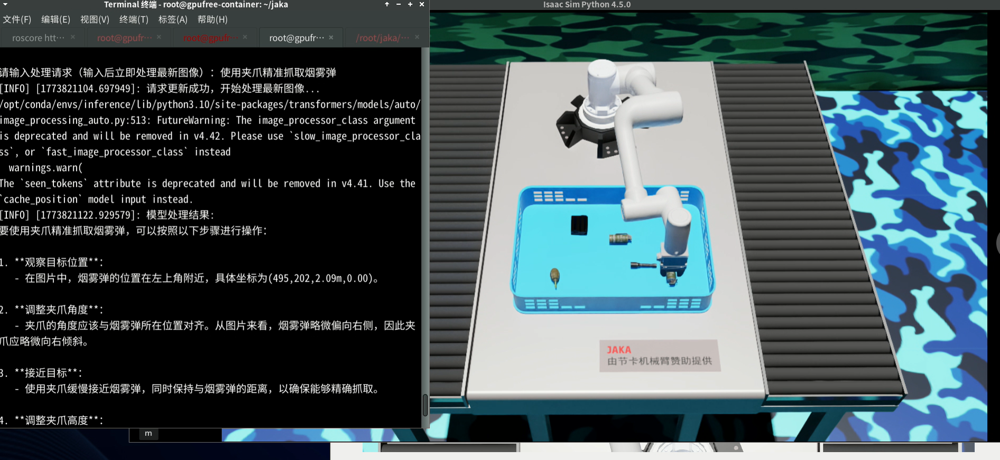
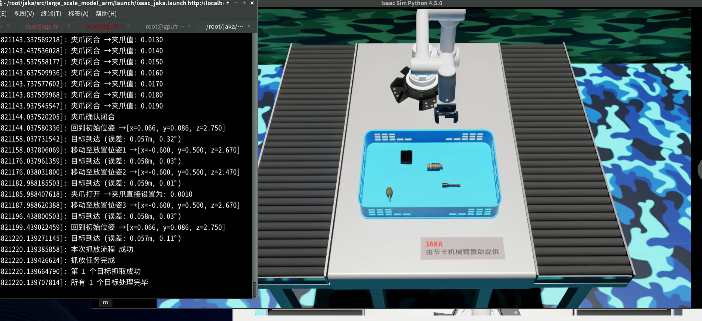

# 2026无人系统具身智能算法挑战赛--机械臂物资分拣场景使用手册

## 介绍

​	本手册专为" 2026无人系统具身智能算法挑战赛 "中的机械臂物资分拣场景应用挑战赛参赛队伍设计，提供完整的大模型-机械臂协同开发指导手册。手册围绕"视觉感知-决策控制-机械臂执行"的技术闭环，帮助参赛者快速构建基于九格大模型的机械臂控制系统。

​	本手册采用"理论→工具→实践"的递进式设计，助力参赛团队快速实现"语言指令→场景理解→动作执行"的智能机械臂控制闭环，为大赛竞技提供了坚实的技术支撑。

```
## 2026无人系统具身智能算法挑战赛 使用手册限制条款

© 2026无人系统具身智能算法挑战赛组委会 版权所有

### **使用授权范围：**  

本手册仅授权以下主体在赛事期间使用：

1. 经组委会认证的参赛团队队员
2. 赛事官方裁判及技术监督人员
3. 组委会授权的培训导师

### **严格禁止事项：**  

-  任何形式的商业性使用或二次销售  
-  向非参赛组织或个人进行传播  
-  改编后用于其他赛事或商业项目  
-  在线平台/文库的公开传播  

### **使用约束：**  

手册所含技术方案、赛事规则及数据参数等知识产权归组委会所有，参赛者仅限：

-  赛事筹备期用于技术方案设计参考
-  正式竞赛期间作为操作规范依据
-  赛后总结阶段用于技术复盘分析

### **免责声明：**  

 本手册内容按"现有状态"提供：
 组委会不承担因手册信息导致的技术方案偏差责任  
 不保证所含方案满足特定技术场景的实施需求  
 对使用后果不承担直接或间接法律责任  

*违反本条款者组委会有权取消参赛资格并追究法律责任*
```


## 仿真部分

### **（一）进入镜像**

点击链接https://www.gpufree.cn/images，进入算力自由镜像仓库，搜索**TCEI 2026 机械臂物资分拣场景应用挑战赛**，选择该镜像，点击快速创建。





初次使用算力自由平台，可以参看平台[快速开始](https://www.gpufree.cn/docs/guide/quick_start.html)https://www.gpufree.cn/docs/guide/quick_start.html文档。

专用镜像体积较大，可能需要较长的拉取时间，需要几分钟或者十几分钟的等待。开机过程是不会收取算力费用的。创建成功之后进入控制台，从控制台进入远程桌面。S

点击进入远程桌面。


### （二）ROS 1环境

进入远程桌面之后，先检查环境，ROS 1环境是已经预装的，通过启动 ROS 1自带的小乌龟节点，测试ROS是否安装成功.

直接开启三个终端：

**终端一：**

```Bash
roscore    
```

**终端二：**

```Bash
rosrun turtlesim turtlesim_node
```

**终端三：**

```Bash
rosrun turtlesim turtle_teleop_key
```

结果输出：

使用键盘上下左右操作，可以看到界面上的小乌龟在按照键盘指令移动。测试完成后可以关闭终端。



### （三）检查文件

比赛的环境包括了：

- 源代码
- ROS 1
- Isaac Sim 4.5
- yolo V8
- 九格大模型

注：在该镜像桌面中，环境与相关的代码已经为选手提前配置好，无需再次配置，若想自己从零开始动手配置，参考该技术文档https://blog.gpufree.cn/blogs/manipulator_build.html。
进入文件管理器，检查文件系统中各文件是否形成以下目录形式，确保文件位置，防止仿真过程中找不到文件而出现错误。

```
/root/
```

```
├── jaka/
├── EAICON/
├── inference/
​    └── Embodied/
​    └── FM9G4B-V/
```


### （四）IsaacSim 4.5环境

检查Isaac Sim是否能成功启动，Isaac Sim安装在`/root/isaacsim`，打开新终端：

```Bash
cd /root/isaacsim
#启动
./isaac-sim.sh
```

首次启动，需要访问 Nvidia 官方下载部分相关文件，可能会较慢。在使用之前，建议关闭 Isaac Sim 默认的Eco Mode，并打开 DLSS 以提高性能。


测试完成之后关闭该终端。

### （五）测试模型

测试是否能运行九格大模型，打开终端二：

```bash
#激活虚拟环境：
conda activate inference
#测试模型
cd /root/inference/Embodied/inference
#修改test.py的模型文件夹
#将test.py中的/model/FM9G4B-V修改为/root/inference/FM9G4B-V
sed -i 's|/model/FM9G4B-V|/root/inference/FM9G4B-V|g' test.py 
#启动测试文件
python test.py
```

输出下图即为测试成功：


至此，环境检测完毕，关闭所有终端。

### （六）启动仿真

需要多个终端窗口：

**终端一：**

```Bash
roscore     
```

**终端二：**

```Bash
#进入工作空间
cd /root/EAICON
#启动仿真环境
sh run_jaka_sim.sh
```

启动后如下图所示，需等待出现完整机械臂以及完整环境再执行终端三。



**终端三：**

```Bash
#进入工作空间
cd /root/jaka
#激活 yolov8 环境
conda activate yolov8
#运行 Python文件
rosrun large_scale_model_arm isaac_yolov8.py
```

出现 YOLOv8 视觉识别场景，如图所示，再执行终端四。

**终端四：**

```Bash
#进入工作空间
cd /root/jaka
#激活 inference 环境
conda activate inference
#运行 Python文件
rosrun large_scale_model_arm isaac_scale.py
```

大模型已加载成功，可以理解文本指令，如图：



**终端五：**

```Bash
#进入工作空间
cd /root/jaka
#退出当前环境，返回默认环境
conda deactivate
#运行 launch文件
roslaunch large_scale_model_arm isaac_jaka.launch
```



机械臂仿真已全部启动，在终端四里输入文本指令。

示例：抓取烟雾弹。





### （七）大模型接口

该版本通用大模型参数量为40亿，具有高效训练与推理和高效适配与部署的技术特点，具备文本问答、文本分类、机器翻译、文本摘要等自然语言处理能力。九格百亿级通用基础大模型的参数量为4B（40亿）。具体的模型训练、推理等内容见：[九格大模型快速开始](https://www.osredm.com/jiuyuan/CPM-9G-8B/tree/master/quick_start_clean/readmes/README_ALL.md)

 本表聚焦“九格”接口设计中与大模型相关的部分，将其抽象为模型加载、推理调用两大核心单元，具体接口列表如下：

|   接口名称   |                      描述                       |                         调用方式                          |                           输入参数                           |                          输出                          |                      异常处理                       |
| :----------: | :---------------------------------------------: | :-------------------------------------------------------: | :----------------------------------------------------------: | :----------------------------------------------------: | :-------------------------------------------------: |
| 模型加载接口 |    从本地或远程路径加载大模型及其 Tokenizer     | `AutoModel.from_pretrained AutoTokenizer.from_pretrained` | `model_file` (字符串)：权重与配置存放路径  `trust_remote_code` (布尔)：是否信任远程自定义代码 | `self.model` (模型对象)  `self.tokenizer` (分词器对象) | 捕获并 `rospy.logerr`，加载失败时置空并退出订阅流程 |
| 推理调用接口 | 根据输入图像与文本 Prompt，调用模型生成推理结果 | `model.chat(image=None, msgs, tokenizer=self.tokenizer)`  |                  `msgs` (列表)：每项为字典                   |                                                        |                                                     |

#### 1.模型加载接口

```Python
  self.model = AutoModel.from_pretrained(
      model_file: str,
      trust_remote_code: bool = True,
      attn_implementation: str = 'sdpa',
      torch_dtype: torch.dtype = torch.bfloat16
  )
  self.tokenizer = AutoTokenizer.from_pretrained(
      model_file: str,
      trust_remote_code: bool = True
  )
```

（1）参数说明：

 `model_file`：本地或远程路径，预训练模型权重与配置所在目录。

 `trust_remote_code`：是否信任并执行仓库中的自定义代码。

 `attn_implementation` 与 `torch_dtype`：可选优化参数。

（2）输出说明：

 `self.model`：已加载并 eval() 的模型实例，已切换到 CUDA（若可用）。

 `self.tokenizer`：对应的分词器，用于构造输入tokens。

（3）异常处理：

 捕获任何加载错误，调用 `rospy.logerr`(“模型加载失败: %s”, e) 并将`self.model/self.tokenizer` 置为 None，后续流程根据空值判断跳过订阅与推理。

#### 2.推理调用接口

```Python
model_res = self.model.chat(
    image=None,
    msgs: List[Dict[str, Any]],
    tokenizer=self.tokenizer
)
```

（1）输入说明

 `msgs`：长度可变的消息列表，每条消息格式为：

```Python
{
  'role': 'user',
  'content': [pil_image: PIL.Image.Image, prompt: str]
}
```

 `pil_image`：从最新 ROS 彩色帧转换而来。

 `prompt`：用户或上层脚本动态输入的文本提示。

（2）输出说明

 `model_res`：大模型返回的推理结果，可为文本、结构化数据或二次封装，随后转换为字符串发布。

（3）调用时机

 在 `self.new_bbox_request == True` 且最新图像帧已获取时触发。

（4）异常处理

推理过程中捕获任何异常并调用 `rospy.logerr`(“调用大模型进行处理时出错: %s”, e)，当前帧推理终止，不影响后续请求。

### （八）机械臂接口

#### 1.运动控制接口

 本表列出了本次仿真中机械臂及夹爪的 ROS 话题接口。

|           话题名称            |          消息类型           | 发布/订阅 |                           功能说明                           |
| :---------------------------: | :-------------------------: | :-------: | :----------------------------------------------------------: |
| `/Jaka/get_end_effector_pose` | `geometry_msgs/PoseStamped` |   发布    |    获取末端执行器（机械臂手腕）在基座坐标系下的位置和姿态    |
| `/Jaka/set_end_effector_pose` | `geometry_msgs/PoseStamped` |   订阅    |                 设置末端执行器目标位置和姿态                 |
|   `/Jaka/get_gripper_value`   |     `std_msgs/Float64`      |   发布    |    获取当前夹爪开合关节的数值（单位：米，范围 0 – 0.04）     |
|   `/Jaka/set_gripper_value`   |     `std_msgs/Float64`      |   订阅    |       发送夹爪目标开合数值（单位：米，范围 0 – 0.04）        |
|    `/Jaka/get_jointstate`     |  `sensor_msgs/JointState`   |   发布    |            获取机器人各关节的当前位置、速度和力矩            |
|          `/Jaka/tf`           |            `tf`             |   发布    |                 发布机器人各坐标系之间的变换                 |
|  `/Jaka/gripper_is_captured`  |       `std_msgs/Bool`       |   发布    | 夹爪是否已经抓取到物体，True 表示成功抓取，False 表示尚未抓取 |

##### 1.1夹爪控制逻辑—增量闭合策略

- 从 `/Jaka/get_gripper_value` 读取当前夹爪开合数值 `g`。

- 在循环中，以固定步长 Δ=0.001 m 递增发送：

```Plain
new_g = g + 0.001
publish("/Jaka/set_gripper_value", new_g)
```

- 每次发送后，订阅 `/Jaka/gripper_is_captured` 话题：
- 若返回 `False`，继续增量闭合；
- 若返回 `True`，表示夹爪已成功夹住物品，停止发送增量命令。

#### 2.相机接口

本表列出了仿真中相机相关的 ROS 话题接口，用于获取深度图、相机参数以及 RGB 图像。

|       话题名称       |         消息类型         | 发布/订阅 |                           功能说明                           |
| :------------------: | :----------------------: | :-------: | :----------------------------------------------------------: |
| `/Jaka/camera_depth` |   `sensor_msgs/Image`    |   发布    |  深度相机图像，像素值为深度（单位：米），用于场景深度感知。  |
| `/Jaka/camera_info`  | `sensor_msgs/CameraInfo` |   发布    | 相机内参（焦距、光心、畸变系数等），供图像去畸变与三维重建使用。 |
|  `/Jaka/camera_rgb`  |   `sensor_msgs/Image`    |   发布    | RGB 彩色图像（编码：rgb8），用于视觉检测、语义分割或显示画面。 |

（1）深度图像 (`/Jaka/camera_depth`)：

- 常见编码：`32FC1` 或 `16UC1`
- 可直接用于点云生成或距离测量。

（2）相机信息 (`/Jaka/camera_info`)：

- 包含 `K`（3×3 内参矩阵）、`D`（畸变系数）、`R`（旋转矩阵）、`P`（投影矩阵）等字段。
- 与图像话题配对使用，确保去畸变与精确投影。

（3）彩色图像 (`/Jaka/camera_rgb`)：

- 编码 `rgb8`，分辨率与帧率与深度图保持一致。
- 可用于目标检测、语义分割、大模型推理等上层算法输入。

#### 3.规划控制接口

| 类 / 位置                                                   |                             函数                             |                      说明                       |   调用时机   |
| ----------------------------------------------------------- | :----------------------------------------------------------: | :---------------------------------------------: | :----------: |
| `JakaRmpFlowController` ([jaka_env.py](http://jaka_env.py)) | `plan_and_execute_trajectory(target_pos, target_rot_wxyz, duration=5.0)` |       末端 IK → `TRRT*` → 样条 → 保存轨迹       | 收到新目标时 |
|                                                             |         `update_trajectory_tracking(gripper_value)`          | 依据 `self.trajectory` 做线性插值并下发关节位置 |     每帧     |
|                                                             |           `forward_and_track(gripper_value=None)`            |             包装：跟踪 + 夹爪状态机             |     每帧     |
|                                                             |                  `get_end_effector_pose()`                   |        正向解算，返回 (`pos, quat_wxyz`)        |     多处     |
|                                                             |                          `reset()`                           |                 初始化关节/夹爪                 | world.reset  |
| `SimEnvironment` ([jaka_sim.py](http://jaka_sim.py))        |                           `step()`                           |  检测新目标 → 调规划 → 调跟踪 → 发布 ROS 数据   |     每帧     |
|                                                             |                     `publish_ros_data()`                     |    发 `/pose /joint_states /gripper_efforts`    |     每帧     |